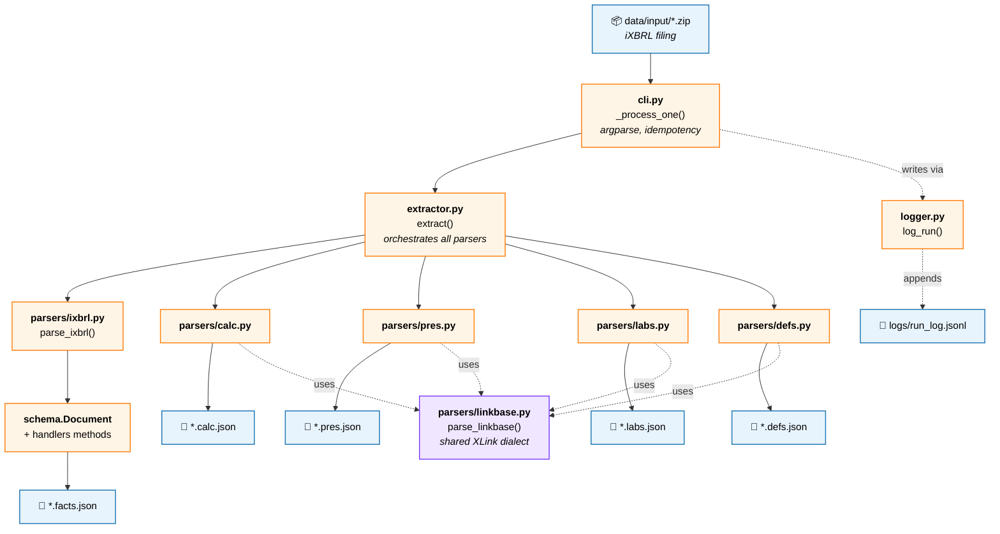

# xbrl-extraction

Transform iXBRL filing zips into structured JSON, then query, validate,
and reconstruct financial statements from the result.

One `.zip` in → five `.json` files out (facts plus four linkbases). No
canonical naming, no external taxonomies, no opinions about what the
data means. The output is a faithful structural transcription, designed
to be loaded into pandas or operated on through the `Document` API.

---

## Table of contents

1. [What it does (and what it doesn't)](#what-it-does-and-what-it-doesnt)
2. [The mental model](#the-mental-model)
3. [Design choices and why](#design-choices-and-why)
4. [Project layout](#project-layout)
5. [Data workflow](#data-workflow)
6. [Setup](#setup)
7. [CLI usage](#cli-usage)
8. [Programmatic usage](#programmatic-usage)
9. [Output schema](#output-schema)
10. [Run log](#run-log)
11. [Limitations](#limitations)
12. [Migration from v1](#migration-from-v1)
13. [Development](#development)

---

## What it does (and what it doesn't)

**Does:**

- Reads SEC iXBRL filing zips (`<ticker>-<date>.htm` plus `.xsd` and
  linkbase XML files).
- Locates the primary iXBRL document — works for 10-K, 10-Q, 20-F,
  8-K, S-1, etc. regardless of filename.
- Parses every `ix:nonFraction` fact, preserving concept, value,
  context, unit, and dimensions exactly as filed.
- Parses all four linkbases:
  - **calculation** (`_cal.xml`) — arithmetic: `parent = Σ weight × child`.
  - **presentation** (`_pre.xml`) — statement structure and display order.
  - **labels** (`_lab.xml`) — human-readable names for concepts.
  - **definitions** (`_def.xml`) — dimensional constraints.
- Auto-detects accounting standard (US-GAAP / IFRS) from concept
  namespaces.
- Lifts filing metadata (form, fiscal year, fiscal period, period end)
  from the filing's `dei:` facts.
- Provides a `Document` class for filtering, dataframe export,
  calc-aware navigation, arithmetic verification, and indented
  statement reconstruction.
- Writes five JSONs per filing and appends a structured record per run
  to `logs/run_log.jsonl`.

**Does not:**

- Apply any canonical taxonomy or "friendly name" mapping. Output uses
  raw XBRL concept names (`us-gaap:Assets`, not `"Total Assets"`).
- Normalize values to a base unit. `307003` with `scale: "6"` stays
  `307003` with `scale: "6"`. Consumer interprets.
- Parse `ix:nonNumeric` facts (textual MD&A, policy disclosures).
  Numeric only.
- Enrich with entity metadata (ticker, CIK, name) beyond what's in the
  filing.
- Side-by-side multi-period statement rendering — single period only
  for v2 (see [Limitations](#limitations)).
- Compare filings, build time-series, or do any cross-filing analysis.
  That belongs to a separate downstream module.

---

## The mental model

An iXBRL document has three orthogonal axes that v1 preserves
faithfully:

1. **Concept** — what the number is (`us-gaap:Assets`).
2. **Context** — when/whose: a reporting period (instant or duration)
   plus optional dimensions (segment, product line, geography, etc.).
3. **Unit** — what it's denominated in (USD, shares, USD-per-share).

Each `ix:nonFraction` in the source is one *fact* — concept + context +
unit + numeric value.

v2 adds **four side files** describing relationships between concepts
that aren't carried in the facts themselves:

| File | Content | Used for |
|---|---|---|
| `.calc.json` | "Assets = AssetsCurrent + AssetsNoncurrent" | `verify()`, statement signs |
| `.pres.json` | "Cash appears under Current Assets, in this order" | filtering by statement, statement rendering |
| `.labs.json` | `us-gaap:Assets` → "Total assets" | pretty labels everywhere |
| `.defs.json` | "ProductOrServiceAxis applies to RevenueLineItems" | dimensional validators (future) |

All five files use the same raw concept names as the universal join
key. Nothing nested, no translation layer — flat lists of edges, with
the consumer rebuilding trees on demand via `Document.tree()` etc.

---

## Design choices and why

**Values as filed, not as dollars.** Every other XBRL consumer in the
wild (SEC EDGAR API, arelle, financial data vendors) preserves the
as-filed form. Round-tripping back to source matters more than display
convenience.

**Raw `contextRef` ids for periods.** Pretty ids like `"FY2024"` need
heuristics that break in edge cases (what does "FY" mean for an August
year-end?). Using `c-12` is ugly but unambiguous.

**Three-tier primary-document detection.** SEC zips sometimes contain
`FilingSummary.xml`; sometimes they don't. The fallback (sniff
`xmlns:ix=`) works on every filing structure we've tested across form
types.

**Skip non-numeric facts.** A 10-K has ~1,000 numeric facts and 10,000+
non-numeric. Consumers wanting prose disclosures have better tools.

**Linkbases are separate files, not merged.** Facts is the 95% case;
calc/pres/labs/defs are separate concerns. Loading all five is a single
`Document.load_all()` call; loading just facts is `Document.load()`.

**Linkbase failures degrade gracefully.** A malformed `_cal.xml` logs a
warning and leaves `result.calc = None` — the facts.json still ships.
The pipeline never fails the whole filing on a bad linkbase.

**Parser separated from extractor.** `parsers/` contains five
format-specific parsers (one per source format). `extractor.py`
orchestrates them and assembles the output. Swap output formats
without touching parsers.

**Bind handler methods onto `Document`, don't subclass.** `extract()`
returns a `Document` (via `ExtractionResult.document`); handlers add
methods directly. Consumers call `doc.filter(...)`, `doc.verify(...)`
without converting.

---

## Project layout

```
xbrl-extraction/
├── README.md
├── CHANGELOG.md
├── pyproject.toml
├── Makefile
├── .env.example
├── .gitignore
│
├── src/
│   └── xbrl_extraction/
│       ├── __init__.py            # public re-exports
│       ├── __main__.py            # python -m xbrl_extraction
│       ├── cli.py                 # argparse + orchestration
│       ├── extractor.py           # zip → ExtractionResult
│       ├── schema.py              # Document, Filing, Period, Unit, Fact
│       ├── linkbases.py           # Calculations, Presentation, Labels, Definitions
│       ├── handlers.py            # filter, verify, render_statement, etc.
│       ├── utils.py               # primary-doc detection, number cleaning
│       ├── logger.py              # console + run_log.jsonl
│       └── parsers/               # one file per source format
│           ├── __init__.py
│           ├── ixbrl.py           # iXBRL .htm parser
│           ├── linkbase.py        # shared XLink parser
│           ├── calc.py            # _cal.xml extractor
│           ├── pres.py            # _pre.xml extractor
│           ├── labs.py            # _lab.xml extractor
│           └── defs.py            # _def.xml extractor
│
├── data/
│   ├── input/                     # drop *.zip filings here
│   ├── output/                    # *.{facts,calc,pres,labs,defs}.json
│   └── _debug/
│
├── logs/
│   └── run_log.jsonl              # appended, one line per filing
│
├── tests/
│   ├── test_setup.py
│   ├── test_parser.py
│   ├── test_linkbase_parser.py
│   ├── test_extractor.py
│   ├── test_calc_extractor.py
│   ├── test_pres_extractor.py
│   ├── test_labs_extractor.py
│   ├── test_defs_extractor.py
│   └── test_handlers.py           # the big one — 30+ tests
└── notebooks/
```

---

## Data workflow

Each node shows the file responsible and its key function. Solid arrows
are the data path; dashed arrows show ancillary writes.



---

## Setup

Requires Python 3.10 or later.

```bash
git clone <repo>
cd xbrl-extraction
make install               # pip install -e ".[dev]"
```

No API keys, no service accounts, no environment variables.

---

## CLI usage

**Single file:**

```bash
python -m xbrl_extraction data/input/aapl-20250927.zip
```

**Batch (every `*.zip` in a directory):**

```bash
python -m xbrl_extraction data/input/
```

Output:

```
✓ aapl.zip  (830 facts, calc=213, pres=749, labs=1452, defs=373, 0.53s)
```

Five files are produced per input zip:

```
data/output/aapl.facts.json
data/output/aapl.calc.json
data/output/aapl.pres.json
data/output/aapl.labs.json
data/output/aapl.defs.json
```

**Idempotency.** A zip is skipped when all five output files exist. Any
missing → all five regenerated (consistent-state rule). Pass `--force`
to re-extract regardless:

```bash
python -m xbrl_extraction data/input/ --force
```

If a linkbase file is missing inside the source zip (rare), that one
output is skipped with a warning and the other four still produce.

---

## Programmatic usage

```python
from xbrl_extraction import Document

# Load facts + auto-attach sibling linkbase files
doc = Document.load_all("data/output/aapl.facts.json")

# One-page overview
print(doc.summary())

# Filter chainably; each filter returns a new Document with pruned
# periods/units. Filters AND together.
revenue_fy = (
    doc.filter(concept_contains="Revenue")
       .filter(no_dimensions=True)
       .filter(fiscal_year_only=True)
)

# Exit the Document world to pandas for analysis
df = revenue_fy.to_dataframe()
print(df[["concept", "value", "scale", "period_end"]])

# Walk the calc tree
for child in doc.children_of("us-gaap:Assets",
                             role_short="CONSOLIDATEDBALANCESHEETS"):
    print(child)
# → {'concept': 'us-gaap:AssetsCurrent', 'weight': 1.0, ...}
# → {'concept': 'us-gaap:AssetsNoncurrent', 'weight': 1.0, ...}

# Verify the balance sheet arithmetic — strict by default
verify_df = doc.verify(role_short="CONSOLIDATEDBALANCESHEETS",
                       period_end="2025-09-27",
                       tolerance=0.0)
print(verify_df["status"].value_counts())

# Reconstruct the balance sheet as indented text
print(doc.render_statement(
    role_short="CONSOLIDATEDBALANCESHEETS",
    period_end="2025-09-27",
))
```

Sample `render_statement()` output (Apple FY2025, abridged):

```
CONSOLIDATED BALANCE SHEETS — period ending 2025-09-27 (in millions USD)

    Statement of Financial Position [Abstract]
      ASSETS:
        Current assets:
        + Cash and cash equivalents                                  35,934
        + Marketable securities                                      18,763
        + Accounts receivable, net                                   39,777
        + Vendor non-trade receivables                               33,180
        + Inventories                                                 5,718
        + Other current assets                                       14,585
          Total current assets                                      147,957
        Non-current assets:
        + Marketable securities                                      77,723
        + Property, plant and equipment, net                         49,834
        + Other non-current assets                                   83,727
          Total non-current assets                                  211,284
        Total assets                                                359,241
```

`+ ` leaves are calc children with weight 1; `- ` leaves have weight -1
(subtractions). Subtotals (rows that are calc parents) get no sign.

### Loading without auto-discovery

```python
# Facts only
doc = Document.load("data/output/aapl.facts.json")

# Explicit attachment
doc.attach_calc("data/output/aapl.calc.json")
doc.attach_pres("data/output/aapl.pres.json")
doc.attach_labs("data/output/aapl.labs.json")

# Methods that need an unattached linkbase raise a clear error:
# doc.verify(...)  → RuntimeError: Calculations not attached. Call doc.attach_calc(...) first.
```

`load_all()` warns on each missing sibling; pass `quiet=True` to
silence.

---

## Output schema

### facts.json

The v1 shape, unchanged:

```json
{
  "filing": { "form": "10-K", "fiscal_year": 2025, "period_end": "2025-09-27", ... },
  "periods": { "c-1": { "type": "duration", "start": "2024-09-29", "end": "2025-09-27" }, ... },
  "units":   { "usd": { "measure": "iso4217:USD" }, ... },
  "facts":   [
    { "concept": "us-gaap:Assets", "value": 359241, "unit": "usd",
      "period": "c-2", "decimals": "-6", "scale": "6" },
    { "concept": "us-gaap:RevenueFromContractWithCustomerExcludingAssessedTax",
      "value": 307003, "unit": "usd", "period": "c-12",
      "decimals": "-6", "scale": "6",
      "dimensions": { "srt:ProductOrServiceAxis": "us-gaap:ProductMember" } }
  ]
}
```

### calc.json

Flat list of arithmetic edges, plus role definitions:

```json
{
  "filing": { ... },
  "role_definitions": {
    "http://www.apple.com/role/CONSOLIDATEDBALANCESHEETS": "CONSOLIDATED BALANCE SHEETS",
    ...
  },
  "calculations": [
    { "role": "http://www.apple.com/role/CONSOLIDATEDBALANCESHEETS",
      "role_short": "CONSOLIDATEDBALANCESHEETS",
      "parent": "us-gaap:Assets",
      "child":  "us-gaap:AssetsCurrent",
      "weight": 1.0, "order": 1.0 },
    ...
  ]
}
```

### pres.json

Same shape as calc, with `preferred_label` instead of `weight`, and
human-readable `role_definition` inlined on each arc:

```json
{
  "filing": { ... },
  "presentation": [
    { "role": "...", "role_short": "CONSOLIDATEDBALANCESHEETS",
      "role_definition": "CONSOLIDATED BALANCE SHEETS",
      "parent": "us-gaap:StatementOfFinancialPositionAbstract",
      "child":  "us-gaap:AssetsAbstract",
      "order":  1.0,
      "preferred_label": "http://www.xbrl.org/2003/role/terseLabel" },
    ...
  ]
}
```

### labs.json

Flat list of label records. A concept usually has 2–6 labels:

```json
{
  "filing": { ... },
  "labels": [
    { "concept": "us-gaap:Assets",
      "label_role": "http://www.xbrl.org/2003/role/label",
      "language": "en-US",
      "text": "Assets" },
    { "concept": "us-gaap:Assets",
      "label_role": "http://www.xbrl.org/2003/role/totalLabel",
      "language": "en-US",
      "text": "Total assets" },
    ...
  ]
}
```

### defs.json

Dimensional relationships. `arc_role` is stripped to its local name
(`hypercube-dimension`, `domain-member`, etc.) and `from`/`to` carry
concept names:

```json
{
  "filing": { ... },
  "definitions": [
    { "role": "...", "role_short": "RevenueDetails",
      "arc_role": "hypercube-dimension",
      "from": "us-gaap:RevenueLineItems",
      "to":   "srt:ProductOrServiceAxis",
      "order": 1.0 },
    ...
  ]
}
```

### Understanding `scale` and `decimals`

Both attributes describe how to interpret the raw `value`, but for
different reasons.

**`scale`** is a presentation hint. "The displayed number has been
divided by 10^scale for readability." `scale="6"` with `value=307003`
means the underlying number is 307,003 × 10⁶ = $307.003 billion.

**`decimals`** is a precision declaration. Negative `decimals` means
precision to the *left* of the decimal point (rounded to thousands,
millions, etc.); positive means to the right.

| `decimals` | Meaning | Example |
|---|---|---|
| `"-6"` | accurate to the nearest million | `307003` → ±$500k |
| `"-3"` | accurate to the nearest thousand | `918691` → ±$500 |
| `"2"` | accurate to the nearest cent | `6.62` → ±$0.005 |
| `"INF"` | exact | share counts, ratios |

To recover the as-reported dollar amount: `value * 10**int(scale)`.

---

## Run log

`logs/run_log.jsonl` is appended once per file actually processed.
Skipped files (idempotency) do not produce records.

```jsonc
{
  "ts": "2026-05-14T10:45:21+00:00",
  "source_file": "aapl.zip",
  "status": "success",
  "elapsed_seconds": 0.534,
  "facts_total": 830,
  "calc_edges": 213,
  "pres_edges": 749,
  "labs_count": 1452,
  "defs_edges": 373,
  "output_files": [
    "aapl.facts.json", "aapl.calc.json", "aapl.pres.json",
    "aapl.labs.json", "aapl.defs.json"
  ],
  "error": null
}
```

Status is one of `success`, `parse_error`, `io_error`. On failure,
counts are 0, `output_files` is `[]`, and `error` carries the message.

Quick queries with `jq`:

```bash
# Failed runs only
jq 'select(.status != "success")' logs/run_log.jsonl

# Total facts across all successful runs
jq -s '[.[] | select(.status == "success") | .facts_total] | add' logs/run_log.jsonl
```

---

## Limitations

- **Numeric facts only.** `ix:nonNumeric` is skipped.
- **`ix:fraction` is not parsed.** Rare in SEC filings; if you hit one,
  open an issue with a sample.
- **Single-period statement rendering.** `render_statement()` shows
  one period at a time. Side-by-side multi-period rendering (e.g.
  FY2024 vs FY2025 columns) is deferred — it requires aligning labels
  across periods, picking a common scale, and handling concepts that
  exist in one period but not the other.
- **No multi-filing operations.** Cross-filing analysis (comparison,
  time series) belongs to a separate downstream module.
- **No entity metadata enrichment.** Ticker/CIK/company name beyond
  what's in the source `dei:` facts is out of scope.
- **Duplicate facts deduplicated by `(concept, contextRef)`.** When a
  filing tags the same value in multiple places, only the first
  occurrence is kept.
- **IFRS support is provisional.** Works on SEC-filed IFRS (20-F);
  non-SEC IFRS filings may carry different metadata conventions.
- **Statement reconstruction needs all three** of `calc`, `pres`, and
  `labs`. Without `calc` the `+`/`-` signs go away; without `labs` you
  get raw concept names; without `pres` it errors.

---

## Migration from v1

v2.0.0 is a hard-break release. No shims.

**Affected import path:**

```python
# v1
from xbrl_extraction.parser import parse_ixbrl

# v2
from xbrl_extraction.parsers.ixbrl import parse_ixbrl
# or, preferred:
from xbrl_extraction import parse_ixbrl
```

**`extract()` return type:**

```python
# v1
doc = extract("filing.zip")

# v2
result = extract("filing.zip")
doc    = result.document
# Plus: result.calc, result.presentation, result.labels, result.definitions
```

**Run log shape** (for anyone consuming `run_log.jsonl`):

```jsonc
// v1
{ "output_file": "aapl.facts.json", ... }

// v2
{ "output_files": ["aapl.facts.json", "aapl.calc.json", ...],
  "calc_edges": 213, "pres_edges": 749, "labs_count": 1452, "defs_edges": 373,
  ... }
```

See `CHANGELOG.md` for the full breaking-changes list.

---

## Development

Uses **black** for formatting and **ruff** for linting, configured in
`pyproject.toml` to avoid conflicts. Don't run `ruff format` — let
black handle formatting.

### Day-to-day commands

```bash
make install       # pip install -e ".[dev]"
make format        # black src tests
make lint          # ruff check src tests --fix
make test          # pytest
make setup-check   # pytest tests/test_setup.py -v
make clean         # remove build artifacts and caches
make run-sample    # python -m xbrl_extraction data/input/
```

### Running tests

```bash
pytest                          # full suite (93 tests)
pytest tests/test_setup.py -v   # scaffold check
pytest tests/ -k handlers       # filter by name
```

End-to-end tests in `test_extractor.py`, `test_calc_extractor.py`,
etc. look for sample zips in `tests/fixtures/`. If absent they skip
cleanly. To enable:

```bash
mkdir -p tests/fixtures
cp data/input/*.zip tests/fixtures/
pytest
```
