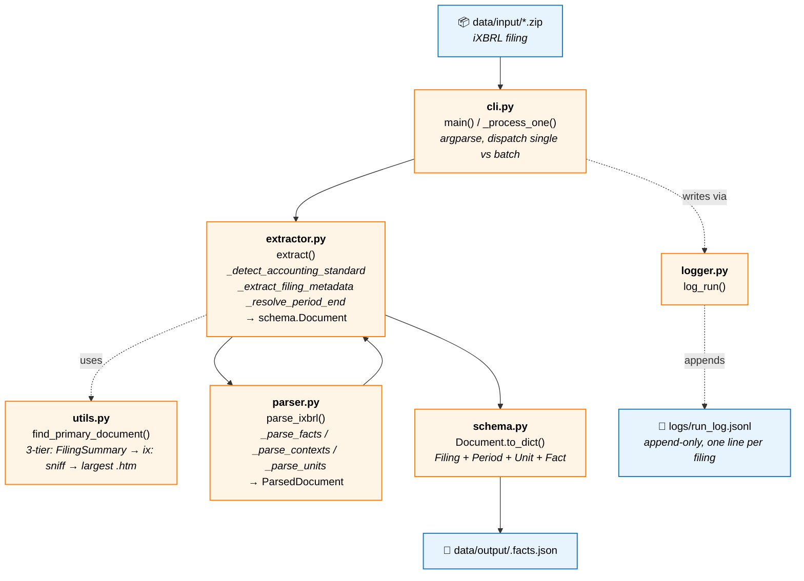

# xbrl-extraction

Transform iXBRL filing zips into structured JSON.

One `.zip` in → one `.facts.json` out. No mapping, no canonical names, no
validation against external taxonomies. The output is a faithful
structural transcription of the source filing, designed to be loaded
into pandas or fed downstream without further processing.

---

## Table of contents

1. [What it does (and what it doesn't)](#what-it-does-and-what-it-doesnt)
2. [The mental model](#the-mental-model)
3. [Design choices and why](#design-choices-and-why)
4. [Project layout](#project-layout)
5. [Data workflow](#data-workflow)
6. [Setup](#setup)
7. [Usage](#usage)
8. [Output schema](#output-schema)
9. [Run log](#run-log)
10. [Limitations](#limitations)
11. [Development](#development)

---

## What it does (and what it doesn't)

**Does:**

- Reads SEC iXBRL filing zips (the ones containing `<ticker>-<date>.htm`
  plus its `.xsd` and linkbase files).
- Locates the primary iXBRL document inside the zip — works for 10-K,
  10-Q, 20-F, 8-K, S-1, etc. regardless of filename.
- Parses every `ix:nonFraction` fact, preserving concept, value,
  context, unit, and dimensions exactly as filed.
- Auto-detects accounting standard (US-GAAP / IFRS) from concept
  namespaces.
- Lifts filing metadata (form, fiscal year, fiscal period, period end)
  from the `dei:` facts in the document itself.
- Writes one `.facts.json` per input zip and appends one structured
  record per run to `logs/run_log.jsonl`.

**Does not:**

- Apply any canonical taxonomy or "friendly name" mapping. The output
  uses raw XBRL concept names (`us-gaap:Assets`, not `"Total Assets"`).
- Normalize values to a base unit. If the filing reports revenue as
  `307,003` with `scale="6"`, the output stores `307003` with
  `scale: "6"`. The consumer interprets.
- Extract calculation relationships (`Assets = CurrentAssets + Noncurrent…`).
  The calculation linkbase is in `_cal.xml` files inside the zip; parsing
  it ships as `.calc.json` in v2.
- Parse `ix:nonNumeric` facts (textual disclosures, MD&A prose, policy
  text). Numeric only.
- Enrich with entity metadata (ticker, CIK, name). The source zip
  contains this in `dei:` facts; extracting them is straightforward
  but out of scope until there's a concrete need.

---

## The mental model

An iXBRL document has three orthogonal axes that this tool preserves
faithfully:

1. **Concept** — what the number is (`us-gaap:Assets`).
2. **Context** — when and whose: a reporting period (instant or
   duration) plus optional dimensions (segment, product line,
   geography, fair-value hierarchy level, etc.).
3. **Unit** — what it's denominated in (`iso4217:USD`, `xbrli:shares`,
   USD-per-share, pure number).

Each `ix:nonFraction` in the source is one *fact* — concept + context +
unit + numeric value. The output JSON is a flat list of facts plus
side tables for periods and units, keyed by their original
`contextRef` / `unitRef` ids from the source. Nothing nested, nothing
denormalised; the list of facts stays one level deep regardless of how
many dimensional breakdowns the filing contains.

This means a segment breakdown like "revenue by product vs service"
shows up as three facts with the same concept, different `dimensions`
tags — not as a nested tree. Group by `concept` to reconstruct.

---

## Design choices and why

**Values as filed, not as dollars.** Storing `307003` with `scale: "6"`
is uglier than storing `307003000000`, but every other XBRL
consumer in the wild (SEC EDGAR API, arelle, financial data
vendors) preserves the as-filed form. Round-tripping back to source
matters more than display convenience, and consumers can multiply
trivially.

**Raw `contextRef` ids for periods.** Pretty ids like `"FY2024"` need
heuristics (what does "FY" mean for an August year-end?), and the
heuristics break in edge cases. Using `c-12` is ugly but zero
ambiguity — and the consumer doesn't care; they get period info via
the lookup, not the id.

**Three-tier primary-document detection.** SEC zips theoretically
contain `FilingSummary.xml` that flags the primary instance, but it's
not always present. The fallback (sniff `xmlns:ix=` in the `<html>`
head) works on every filing structure we've tested and is robust
across form types — no more "10k" string matching.

**Skip non-numeric facts.** A 10-K has roughly 1,000–1,500 numeric
facts and 10,000+ non-numeric (every paragraph of MD&A is one). The
volume difference is large, and consumers who want prose disclosures
have better tools (PDF extraction, full-text indexing) than iXBRL
parsing.

**Parser separated from extractor.** `parser.py` does pure iXBRL →
intermediate dataclasses. `extractor.py` orchestrates the zip handling,
metadata sniffing, and final shape conversion. The split means we can
swap output formats (CSV, Parquet, a different JSON shape) without
touching the parser.

---

## Project layout

```
xbrl-extraction/
├── README.md
├── pyproject.toml
├── Makefile
├── .env.example
├── .gitignore
│
├── src/
│   └── xbrl_extraction/
│       ├── __init__.py
│       ├── __main__.py        # python -m xbrl_extraction
│       ├── cli.py             # argparse + orchestration
│       ├── extractor.py       # zip → schema.Document
│       ├── parser.py          # iXBRL htm → intermediate
│       ├── schema.py          # output dataclasses
│       ├── utils.py           # primary-doc detection, number cleaning
│       ├── logger.py          # console + run_log.jsonl
│       └── handlers.py        # v2 placeholder (filter, to_dataframe, summary)
│
├── data/
│   ├── input/                 # drop *.zip filings here
│   ├── output/                # *.facts.json output
│   └── _debug/                # scratch space
│
├── logs/
│   └── run_log.jsonl          # appended, one line per filing processed
│
├── scripts/                   # empty placeholder
├── tests/
│   ├── test_setup.py
│   ├── test_parser.py
│   └── test_extractor.py      # end-to-end; needs fixtures/
└── notebooks/
```

---

## Data workflow

Each node shows the file responsible and its key function. Solid arrows
are the data path; dashed arrows show ancillary writes.



---

## Setup

Requires Python 3.10 or later.

```bash
git clone <repo>
cd xbrl-extraction
make install               # pip install -e ".[dev]"
```

That's the whole setup. No API keys, no service accounts, no
environment variables — everything runs locally against files in
`data/input/`.

---

## Usage

**Single file:**

```bash
python -m xbrl_extraction data/input/aapl-20250927.zip
```

**Batch (every `*.zip` in a directory):**

```bash
python -m xbrl_extraction data/input/
```

**Custom output / log locations:**

```bash
python -m xbrl_extraction data/input/ -o /tmp/json -v
#                                      └─ verbose (DEBUG-level logging)
```

**Idempotency.** By default, a zip is skipped when its `.facts.json`
already exists in the output directory. Re-running on a folder is
cheap — only new arrivals get extracted. Pass `--force` (or `-f`) to
re-extract everything, for example after an extractor bug fix:

```bash
python -m xbrl_extraction data/input/           # skip already-extracted
python -m xbrl_extraction data/input/ --force   # re-extract everything
```

Output filenames mirror the input: `foo.zip` → `foo.facts.json` in
`data/output/`. With `--force`, existing output files are overwritten
silently.

You can also use the package programmatically:

```python
from xbrl_extraction import extract

doc = extract("data/input/aapl-20250927.zip")
print(doc.filing.form, doc.filing.fiscal_year)   # 10-K 2025
print(len(doc.facts))                            # 830

# Serialize:
import json
json.dump(doc.to_dict(), open("out.json", "w"), indent=2)
```

---

## Output schema

The output is a single JSON object with four top-level keys: `filing`,
`periods`, `units`, `facts`. Periods and units are keyed by the source
filing's own `contextRef` / `unitRef` ids, so each fact references them
by id rather than embedding them.

<details>
<summary><b>Click to expand example JSON</b> (abridged Apple FY2025)</summary>

```json
{
  "filing": {
    "form": "10-K",
    "fiscal_year": 2025,
    "fiscal_period": "FY",
    "period_end": "2025-09-27",
    "accounting_standard": "US-GAAP",
    "source_file": "rawdata_us_1860_1860_XBRL_2025-09-27.zip",
    "primary_document": "aapl-20250927.htm"
  },
  "periods": {
    "c-1":  { "type": "duration", "start": "2024-09-29", "end": "2025-09-27" },
    "c-2":  { "type": "instant",  "date":  "2025-09-27" },
    "c-7":  { "type": "duration", "start": "2023-10-01", "end": "2024-09-28" },
    "c-12": { "type": "duration", "start": "2024-09-29", "end": "2025-09-27" },
    "c-82": { "type": "instant",  "date":  "2024-09-28" }
  },
  "units": {
    "usd":         { "measure": "iso4217:USD" },
    "shares":      { "measure": "xbrli:shares" },
    "usdPerShare": { "numerator": "iso4217:USD", "denominator": "xbrli:shares" },
    "number":      { "measure": "xbrli:pure" }
  },
  "facts": [
    {
      "concept":  "us-gaap:Assets",
      "value":    364980,
      "unit":     "usd",
      "period":   "c-2",
      "decimals": "-6",
      "scale":    "6"
    },
    {
      "concept":  "us-gaap:RevenueFromContractWithCustomerExcludingAssessedTax",
      "value":    307003,
      "unit":     "usd",
      "period":   "c-12",
      "decimals": "-6",
      "scale":    "6",
      "dimensions": {
        "srt:ProductOrServiceAxis": "us-gaap:ProductMember"
      }
    },
    {
      "concept":  "us-gaap:RevenueFromContractWithCustomerExcludingAssessedTax",
      "value":    96169,
      "unit":     "usd",
      "period":   "c-12",
      "decimals": "-6",
      "scale":    "6",
      "dimensions": {
        "srt:ProductOrServiceAxis": "us-gaap:ServiceMember"
      }
    },
    {
      "concept":  "us-gaap:EarningsPerShareBasic",
      "value":    6.62,
      "unit":     "usdPerShare",
      "period":   "c-1",
      "decimals": "2"
    },
    {
      "concept":  "aapl:EquitySecuritiesFVNIAccumulatedGrossUnrealizedGainBeforeTax",
      "value":    177,
      "unit":     "usd",
      "period":   "c-64",
      "decimals": "-6",
      "scale":    "6",
      "dimensions": {
        "us-gaap:FinancialInstrumentAxis":              "us-gaap:MutualFundMember",
        "us-gaap:FairValueByFairValueHierarchyLevelAxis": "us-gaap:FairValueInputsLevel1Member"
      }
    }
  ]
}
```

</details>

### Understanding `scale` and `decimals`

Both attributes describe how to interpret the raw `value`, but they
serve different purposes in the iXBRL spec.

**`scale`** is a *presentation* hint. It says "the displayed number has
been divided by `10^scale` for readability." A filing that prints
"307,003" in a table with a `(in millions)` header will tag that fact
with `scale="6"` — the underlying economic value is 307,003 × 10⁶ =
$307,003,000,000.

**`decimals`** is a *precision* declaration. It says "this value is
accurate to N digits relative to the decimal point." Critically,
**negative `decimals` means precision to the *left* of the decimal
point** (rounded to thousands, millions, etc.); positive means to the
right (cents, basis points).

| `decimals` | Meaning                        | Example                              |
| ---------- | ------------------------------ | ------------------------------------ |
| `"-6"`     | accurate to the nearest million | `307003` → known to ±$500k          |
| `"-3"`     | accurate to the nearest thousand | `918691` → known to ±$500           |
| `"2"`      | accurate to the nearest cent   | `6.62` → known to ±$0.005           |
| `"INF"`    | exact                          | share counts, ratios                 |

The two attributes are often correlated (`scale="6"` with
`decimals="-6"`) but they aren't required to match — and they answer
different questions. `scale` tells you the multiplier; `decimals` tells
you how much of the result you should trust.

#### A worked example

The Apple FY2025 output contains this fact:

```json
{
  "concept":  "us-gaap:RevenueFromContractWithCustomerExcludingAssessedTax",
  "value":    307003,
  "unit":     "usd",
  "period":   "c-12",
  "decimals": "-6",
  "scale":    "6",
  "dimensions": { "srt:ProductOrServiceAxis": "us-gaap:ProductMember" }
}
```

To recover the as-reported dollar amount, multiply by `10^scale`:

```python
actual_usd = fact["value"] * (10 ** int(fact["scale"]))
# 307003 * 10**6 = 307,003,000,000  →  $307.003 billion
```

The `decimals: "-6"` tells you Apple reported this rounded to the
nearest million — so the true figure is $307,003,000,000 ± $500,000.
Don't display it as `$307,003,000,000.00`; the trailing precision is
fake.

#### Why we preserve both

You can derive base-unit dollars from either attribute alone:

- From `scale`: `value × 10^scale`
- From `decimals` (when negative): `value × 10^(-decimals)`

They almost always give the same answer. We keep both for two reasons:
(1) some filings have one but not the other, and (2) `decimals`
carries the precision signal that `scale` doesn't — useful when
consumers need to know how aggressively to round before display.

### Key things to know

- **Values are as filed.** See *Understanding `scale` and `decimals`*
  above for how to recover base-unit values.
- **`period` and `unit` are reference ids** that key into the
  top-level `periods` and `units` dicts. They mirror the source
  `contextRef` / `unitRef` exactly, so output rows round-trip back to
  the iXBRL source.
- **`dimensions` is omitted on facts that don't have any** — keeps the
  JSON readable. When present, keys are XBRL axes and values are the
  selected members. Multiple axes coexist on one fact (see the
  fair-value example above).
- **`fiscal_year` is from `dei:DocumentFiscalYearFocus`** (the filer's
  declared FY), not derived from `period_end`. For an Apple filing with
  period end `2025-09-27`, fiscal year is `2025`. Period end comes from
  the full-year duration context, not from the formatted
  `dei:DocumentPeriodEndDate` text.
- **`accounting_standard`** is auto-detected by counting concept
  namespace prefixes. `us-gaap:` dominant → `"US-GAAP"`; `ifrs-full:`
  dominant → `"IFRS"`; otherwise `null` with a logged warning.

---

## Run log

`logs/run_log.jsonl` is appended once per file *actually processed*.
Never rewritten — re-running the CLI appends new records.

Files skipped by the idempotency check (output already exists, no
`--force`) do NOT produce log records. The log is a record of work
done, not a manifest of inputs seen. To see what's been extracted,
list `data/output/` or query past log entries.

```jsonc
{
  "ts": "2026-05-13T16:49:48+00:00",
  "source_file": "rawdata_us_1860_1860_XBRL_2025-09-27.zip",
  "status": "success",
  "elapsed_seconds": 0.635,
  "facts_total": 830,
  "output_file": "rawdata_us_1860_1860_XBRL_2025-09-27.facts.json",
  "error": null
}
```

Status is one of: `"success"`, `"parse_error"`, `"io_error"`. On
failure, `facts_total` is `0`, `output_file` is `null`, and `error`
contains the exception type and message.

Quick queries with `jq`:

```bash
# Failed runs only
jq 'select(.status != "success")' logs/run_log.jsonl

# Total facts across all successful runs
jq -s '[.[] | select(.status == "success") | .facts_total] | add' logs/run_log.jsonl
```

---

## Limitations

- **Numeric facts only.** `ix:nonNumeric` (text disclosures, policy
  notes, dates as formatted text) is skipped. If you need those, the
  source htm is right there in the zip.
- **No calculation linkbase parsing.** The arithmetic relationships
  (`Assets = CurrentAssets + NoncurrentAssets`) live in `*_cal.xml`
  inside the zip and aren't read by v1. Planned for v2 as a separate
  `.calc.json` output.
- **No presentation linkbase parsing.** Statement grouping
  (BalanceSheet / IncomeStatement / CashFlow) lives in `*_pre.xml`
  and isn't carried into the output. Facts are sorted by concept
  name, not by which statement they belong to.
- **No entity metadata.** The output `filing` block has form and
  period info but no ticker, CIK, or company name. Those are in the
  `dei:` facts; enrichment is left to downstream tooling.
- **Duplicate facts deduplicated by `(concept, contextRef)`.** When a
  filing tags the same value in multiple places (e.g., once in the
  statements, again in the notes), only the first occurrence is kept.
- **`ix:fraction` is not parsed.** Fractions are rare in SEC filings;
  if you hit one, please open an issue with a sample.
- **IFRS support is provisional.** The code path is identical to
  US-GAAP (namespace sniff + dei lookup), and IFRS-filed-with-SEC
  filings (20-F) work, but IFRS filings filed outside SEC may carry
  different filing-metadata conventions.

---

## Development

This project uses **black** for formatting and **ruff** for linting,
configured in `pyproject.toml` to avoid conflicts. Don't run `ruff
format` — let black handle formatting.

### Day-to-day commands

```bash
make install       # pip install -e ".[dev]"
make format        # black src tests
make lint          # ruff check src tests --fix
make test          # pytest
make setup-check   # pytest tests/test_setup.py -v
make clean         # remove build artifacts and caches
make run-sample    # python -m xbrl_extraction data/input/
```

### Running tests

```bash
pytest                          # full suite
pytest tests/test_setup.py -v   # scaffold check only
pytest tests/ -k parser         # filter by name
```

The end-to-end tests in `test_extractor.py` look for sample zips in
`tests/fixtures/`. If absent, those tests skip cleanly. Drop a couple
of filing zips there to enable:

```bash
mkdir -p tests/fixtures
cp data/input/*.zip tests/fixtures/
pytest
```

### Pre-commit hook (optional)

```yaml
# .pre-commit-config.yaml
repos:
  - repo: https://github.com/psf/black
    rev: 24.10.0
    hooks: [{ id: black }]
  - repo: https://github.com/astral-sh/ruff-pre-commit
    rev: v0.7.0
    hooks: [{ id: ruff, args: [--fix] }]
```

```bash
pip install pre-commit
pre-commit install
```
