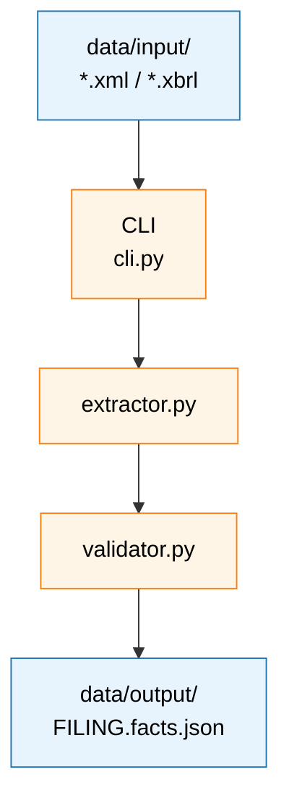

# xbrl-extraction

> TO BE COMPLETED

---

## Table of contents

1. [What it does (and what it doesn't)](#what-it-does-and-what-it-doesnt)
2. [The mental model: two names per fact](#the-mental-model-two-names-per-fact)
3. [Design choices and why](#design-choices-and-why)
4. [Project layout](#project-layout)
5. [Data workflow](#data-workflow)
6. [Setup](#setup)
7. [Usage](#usage)
8. [Output schema](#output-schema)
9. [Run log](#run-log)
10. [Extending the taxonomy](#extending-the-taxonomy)
11. [Limitations](#limitations)
12. [Development](#development)

---

## What it does (and what it doesn't)

> TO BE COMPLETED

---

## The mental model: two names per fact

> TO BE COMPLETED

---

## Design choices and why

> TO BE COMPLETED

---

## Project layout

```
xbrl-extraction/
├── README.md
├── pyproject.toml
├── Makefile
├── .env
├── .env.example
├── .gitignore
│
├── src/
│   └── xbrl_extraction/
│       ├── __init__.py
│       ├── cli.py
│       ├── extractor.py
│       ├── validator.py
│       ├── taxonomy.py
│       ├── schema.py
│       ├── logger.py
│       ├── utils.py
│       └── providers.py
│
├── data/
│   ├── input/
│   ├── output/
│   ├── taxonomies/
│   │   ├── us-gaap.txt
│   │   ├── ifrs-full.txt
│   │   └── README.md
│   └── _debug/
│
├── logs/
│   └── run_log.jsonl
│
├── scripts/
│   ├── fetch_taxonomies.py
│   └── setup_project.py
│
├── tests/
│   ├── test_setup.py
│   ├── test_extractor.py
│   └── test_validator.py
│
└── notebooks/
```

---

## Data workflow



---

## Setup

> TO BE COMPLETED

---

## Usage

> TO BE COMPLETED

---

## Output schema

```json
{
  "entity": {
    "name": "Apple Inc.",
    "ticker": "AAPL",
    "cik": "0000320193",
    "country": "United States",
    "accounting_standard": "US-GAAP"
  },
  "filing": {
    "form": "10-K",
    "fiscal_year": 2024,
    "period_end": "2024-09-28",
    "source_file": "apple_fy2024_10k.xml"
  },
  "periods": {
    "FY2024": {
      "type": "duration",
      "start": "2023-10-01",
      "end": "2024-09-28"
    },
    "instant_2024-09-28": { "type": "instant", "date": "2024-09-28" }
  },
  "facts": [
    {
      "concept": "us-gaap:Revenues",
      "canonical": "Revenue",
      "label": "Total net sales",
      "value": 391035,
      "unit": "USD",
      "scale": "millions",
      "period": "FY2024",
      "statement": "IncomeStatement",
      "concept_valid": true
    },
    {
      "concept": "custom:SegmentNetSales",
      "canonical": null,
      "label": "Americas",
      "value": 167045,
      "unit": "USD",
      "scale": "millions",
      "period": "FY2024",
      "statement": "Note_13_Segments",
      "concept_valid": null,
      "dimensions": { "Segment": "Americas" }
    }
  ]
}
```

Key things to know:

- **Values are not normalized.** `value: 391035` with `scale: "millions"` means $391,035M. Scale is preserved exactly as filed.
- **Periods are defined once** in the `periods` dict and referenced by id on each fact.
- **`canonical: null`** means no match was found in `taxonomy.py`. The fact is still valid — use `concept` and `label` directly.
- **`concept_valid`** is `true` if the concept is in the authoritative tag list, `false` if the namespace is known but the tag is not, and `null` if the namespace is not validated (e.g. `custom:*`).
- **`dimensions`** appears on disaggregated facts (segments, geography, product line) and is omitted otherwise.

---

## Run log

All logs always sit in `logs/`. The file is append-only — one JSON line per filing processed. It is never rewritten; re-running the CLI appends new records.

```jsonc
{
  "ts": "2026-05-09T13:45:32Z",
  "filing": "apple_fy2024_10k.xml",
  "status": "success", // success | parse_error | validation_error
  "elapsed_seconds": 2.14,
  "facts_total": 985,
  "facts_canonical": 612,
  "facts_invalid": 4,
  "output_file": "AAPL_FY2024.facts.json",
  "error": null,
}
```

### Querying the log

> TO BE COMPLETED

---

## Extending the taxonomy

> TO BE COMPLETED

---

## Limitations

> TO BE COMPLETED

---

## Development

This project uses **black** for formatting and **ruff** for linting, configured in `pyproject.toml` to avoid conflicts. Don't run `ruff format` — let black handle formatting.

### Day-to-day commands

```bash
make install       # pip install -e ".[dev]"
make format        # black .
make lint          # ruff check . --fix
make test          # pytest
make setup-check   # pytest tests/test_setup.py -v
```

### Running tests

```bash
pytest                          # full test suite
pytest tests/test_setup.py -v   # scaffold check only
pytest tests/ -k extractor      # filter by name
```

### Pre-commit hook (optional)

```yaml
# .pre-commit-config.yaml
repos:
  - repo: https://github.com/psf/black
    rev: 24.10.0
    hooks: [{ id: black }]
  - repo: https://github.com/astral-sh/ruff-pre-commit
    rev: v0.7.0
    hooks: [{ id: ruff, args: [--fix] }]
```

```bash
pip install pre-commit
pre-commit install
```
